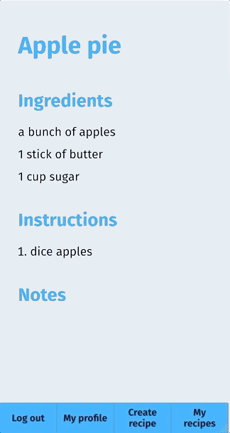

# Recipe Developer

Check it out at https://recipe-developer.vercel.app (username: guestuser, password: guestuserpassword123\$)

## Tl;dr

This app was written in Typescript and React, with a full GraphQL [AWS Lambda][aws lambda] serverless backend using [Apollo server][apollo-server] and an [AWS DynamoDB][dynamodb] database, and login and authentication handled with [Auth0][auth0]. I deployed the front end with [Vercel] (formerly Zeit) and back end with [Serverless][serverless]. Integration and unit tests are written in [Jest][jest].

I first wrote the large majority of this project with plain Javascript rather than Typescript, but then I decided to convert the whole project to Typescript. The only parts that have not been converted are the Jest unit and integration tests.

## Concept

I like to cook and often find myself modifying recipes or creating my own recipes, so I made an app to help me do that.

The app lets you easily create and modify the ingredients, instructions, and notes of any of your recipes. Responsive design was incorporated to make using the app on mobile or tablet easy.

## App flow

Upon logging in, the app presents you with a list of all your recipes. This list is sorted initially by last modified date, but can be sorted by date created or by name.

Clicking on a recipe name brings up that recipe for you to view, and then clicking on any aspect of the recipe (e.g. name, ingredients, notes, etc.) makes that aspect editable. Any changes can then be submitted, and the recipe is updated in the database and returned to reflect the new changes.

There is also a page to create a new recipe.

## TODO

- it would be nice to implement some sort of pagination for the user's recipe list so that all the recipes aren't listed all at once
- convert Jest unit and integration tests to Typescript

[aws lambda]: https://aws.amazon.com/lambda/
[apollo-server]: https://www.apollographql.com/docs/apollo-server/
[auth0]: https://auth0.com/
[dynamodb]: https://aws.amazon.com/dynamodb/
[serverless]: https://www.serverless.com/
[vercel]: https://vercel.com/
[jest]: https://jestjs.io/
